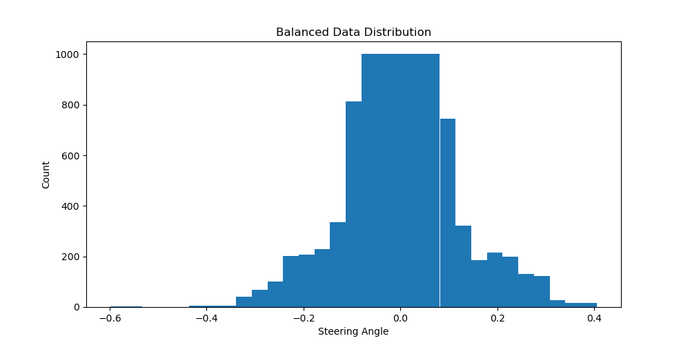
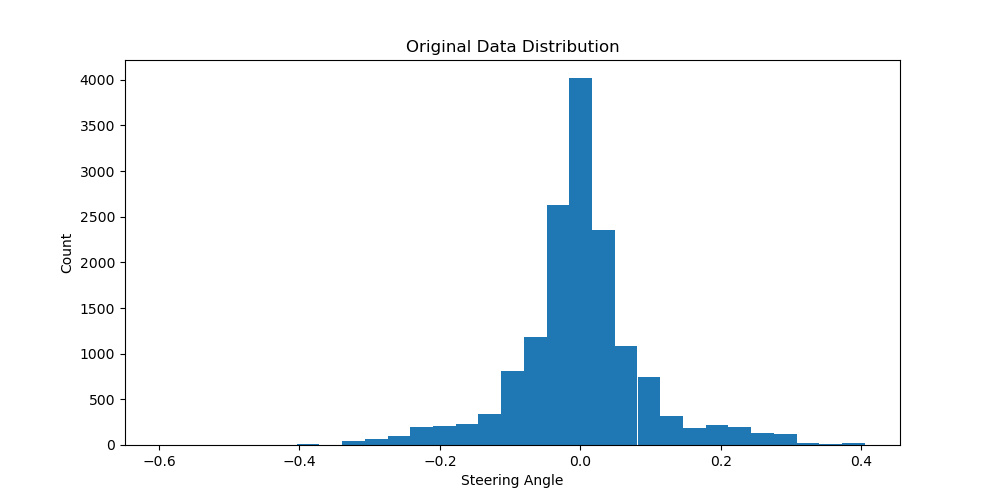
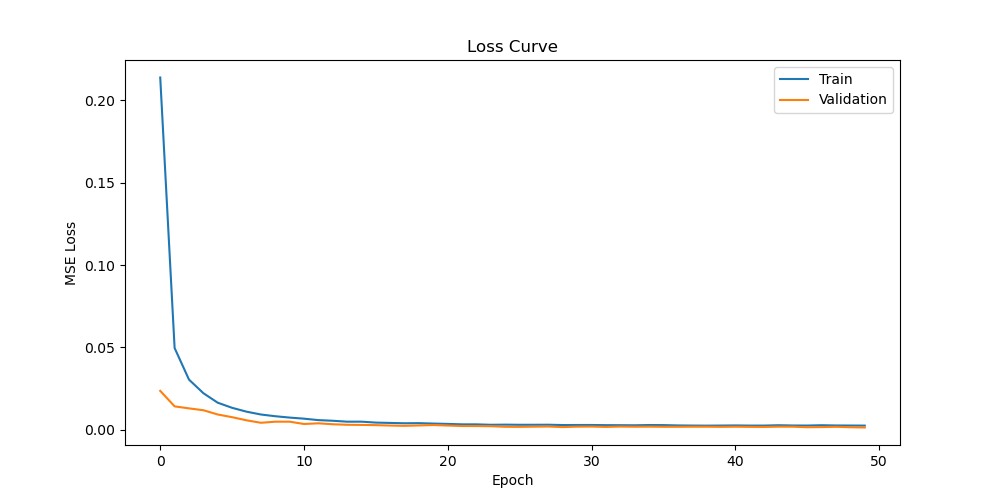

# Autonomous Vehicle Steering with Behavioral Cloning

[](https://github.com/your-username/your-repo/blob/master/LICENSE)


This repository contains a deep learning solution for autonomous vehicle steering using behavioral cloning techniques. The model is trained on human driving data to predict appropriate steering angles for different road conditions.



## Project Overview

This project implements a convolutional neural network (CNN) to clone driving behavior, allowing a vehicle to navigate through a simulated track without human intervention. The model takes images from the car's front-facing cameras as input and predicts steering angle commands.

Key features:

- End-to-end learning for autonomous steering
- Data preprocessing and augmentation techniques
- Model architecture based on NVIDIA's autonomous driving research
- Real-time inference for simulation testing

## Model Architecture

The model architecture is inspired by NVIDIA's paper on end-to-end learning for self-driving cars, with some modifications:

```
_________________________________________________________________
Layer (type)                 Output Shape              Param #
=================================================================
Conv2D (24 filters, 5x5)     (None, 31, 98, 24)        1,824
BatchNormalization           (None, 31, 98, 24)        96
Activation (ELU)             (None, 31, 98, 24)        0
Conv2D (36 filters, 5x5)     (None, 14, 47, 36)        21,636
BatchNormalization           (None, 14, 47, 36)        144
Activation (ELU)             (None, 14, 47, 36)        0
Conv2D (48 filters, 5x5)     (None, 5, 22, 48)         43,248
BatchNormalization           (None, 5, 22, 48)         192
Activation (ELU)             (None, 5, 22, 48)         0
Conv2D (64 filters, 3x3)     (None, 3, 20, 64)         27,712
BatchNormalization           (None, 3, 20, 64)         256
Activation (ELU)             (None, 3, 20, 64)         0
Conv2D (64 filters, 3x3)     (None, 1, 18, 64)         36,928
BatchNormalization           (None, 1, 18, 64)         256
Activation (ELU)             (None, 1, 18, 64)         0
Flatten                      (None, 1152)              0
Dense (100 units)            (None, 100)               115,300
BatchNormalization           (None, 100)               400
Activation (ELU)             (None, 100)               0
Dropout (0.5)                (None, 100)               0
Dense (50 units)             (None, 50)                5,050
BatchNormalization           (None, 50)                200
Activation (ELU)             (None, 50)                0
Dropout (0.5)                (None, 50)                0
Dense (10 units)             (None, 10)                510
BatchNormalization           (None, 10)                40
Activation (ELU)             (None, 10)                0
Dense (1 unit - output)      (None, 1)                 11
=================================================================
Total params: 253,803
Trainable params: 253,011
Non-trainable params: 792
_________________________________________________________________
```

## Training Data

The model was trained on a dataset comprising:

- Center, left, and right camera images from simulator driving
- Steering angle measurements for each frame
- Data balancing to address the bias towards straight driving



## Data Preprocessing & Augmentation

Several techniques were used to preprocess and augment the data:

- Region of interest selection (cropping)
- RGB to YUV color space conversion
- Gaussian blur for noise reduction
- Image resizing to fit the model (66x200)
- Normalization

Augmentation techniques:

- Random brightness adjustment
- Random shadow addition
- Horizontal flipping with steering angle inversion
- Random translation with steering adjustment


## Training Process

The model was trained for 50 epochs with:

- Adam optimizer with a learning rate of 0.001
- Mean squared error (MSE) loss function
- Learning rate reduction on plateau
- Batch size of 64



## Setup and Installation

### Using Anaconda (Recommended)

1. Clone this repository:

   ```bash[
   git clone https://github.com/arionazemirad/CVI620-Final-Project
   ```

2. Create and activate a new conda environment:

   **For Mac users (including M1/M2):**

   ```bash
   conda env create -f environment-mac.yml
   conda activate udacity-car-cvi-mac
   ```

   **For Windows/Linux users:**

   ```bash
   conda create --name udacity-car --file conda-packages.txt
   conda activate udacity-car
   ```

### Manual Installation

If you prefer to set up the environment manually:

1. Create a new conda environment:

   ```bash
   conda create -n udacity-car python=3.8
   conda activate udacity-car
   ```

2. Install the required packages:
   ```bash
   conda install -c conda-forge flask scikit-learn pandas matplotlib numpy opencv h5py jupyter
   pip install tensorflow==2.3.0  # For Windows/Linux, use specific version compatible with your hardware
   pip install tensorflow-macos==2.10.0  # For Mac M1/M2
   pip install eventlet==0.25.1 flask-socketio==3.3.1 python-socketio==4.6.1
   pip install python-engineio==3.13.2 dnspython==1.16.0 imgaug==0.4.0
   ```

## Usage

### Training the Model

To train the model using the provided dataset:

```bash
python TrainModel.py
```

This will:

1. Load and preprocess the driving data
2. Balance the dataset to reduce bias
3. Train the CNN model
4. Save the trained model as `model.h5`
5. Generate visualization plots for data distribution and training loss

### Testing in Simulation

To test the trained model in the simulation:

1. Start the simulator in autonomous mode
2. Run the testing script:
   ```bash
   python TestSimulation.py
   ```

### Data Visualization

To explore and visualize the dataset:

```bash
python DataVisualization.py
```

This will generate various visualizations to help understand the data distribution and preprocessing effects.

## Results

The trained model successfully navigates the simulated track without going off-road or hitting any obstacles. The model demonstrates:

- Smooth steering on straight roads
- Appropriate turning behavior at curves
- Recovery from edge cases
- Consistent driving behavior throughout the track

## License

This project is licensed under the MIT License - see the LICENSE file for details.

## Acknowledgments

- NVIDIA's end-to-end learning for self-driving cars paper
- Udacity Self-Driving Car Engineer Nanodegree
